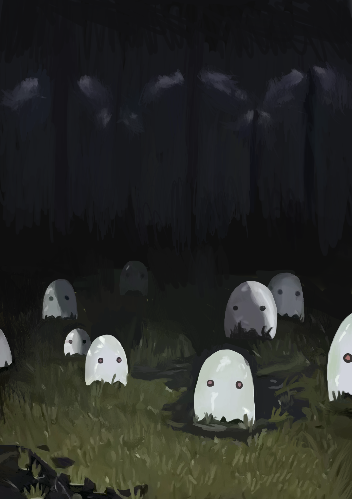

# Ghosts

来源： https://zooliminology.wixsite.com/zoolim/courses-1/ghosts

- 在剩下的生物中，这个小幽灵看起来是最好画的。
- 我并没有注意到环境中的草有多少细节。

拖了近五个月才画完。幽灵本身很好模仿，但画面中的草令人眼花缭乱。我不应该太快下笔的，画面已经刻画了六分之一后我才发现我的画布和原图片的长宽比不一样，导致无论幽灵还是草的比例全是错的。但我也不想改，破罐子破摔了。幸好成品不算太差。

五个月中有四个月都浪费在画这些草上。我容易陷入一种误区，喜欢放大画布一点点刻画我能看到的全部细节。实际上这个操作不仅效率低，成果也可以说是微乎其微——因为没有人看得到，包括我自己。更致命的地方在于，放大画布后画的东西基本都是偏小的。最后收尾阶段我便尝试不放大画布直接画，猛然发现成品比之前差不了太多，效率也是之前完全不能比的。

软件在中间崩溃了一次，导致画面四周多出来了白边。我仍未掌握软件的用法，只能一点一点裁剪。图片最下面那一条白边是我不知为何无法处理掉的。

