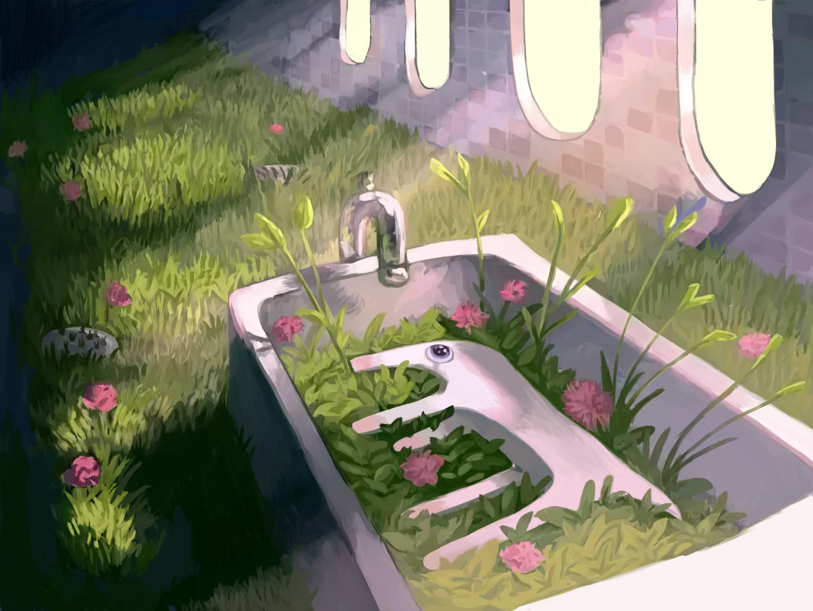

# Golbo

来源： https://zooliminology.wixsite.com/zoolim/courses-1/golbo

- Golbo吸引了我，我也想挑战一个较为复杂的画面。
- 我自认为我已掌握了画草的技巧，结果低估了这幅图片中大量的草带来的难度。
- 我以为我至少可以画得比上次快一点，然而事与愿违。

似乎已经八个月了。我再一次掉入草地与光影的陷阱，在细节上花费过久的时间。我尝试推测无参考绘画时的思路，一层一层铺上颜色，从整体到细节进行刻画。可惜这份兴致在遇到复杂结构后立刻消退，我又回退到对颜色块的拙劣模仿。

有很多地方可以通过观察减少工作量，比如墙壁的绘制。从高亮格子的布局不难推断出，整个墙壁只是一小块墙体的多次复制，不同的观感来自对细节的修改。可惜我没有及时发现这一点。

可能是时候脱离完全的临摹，在画面中增加一些原创的元素了。

